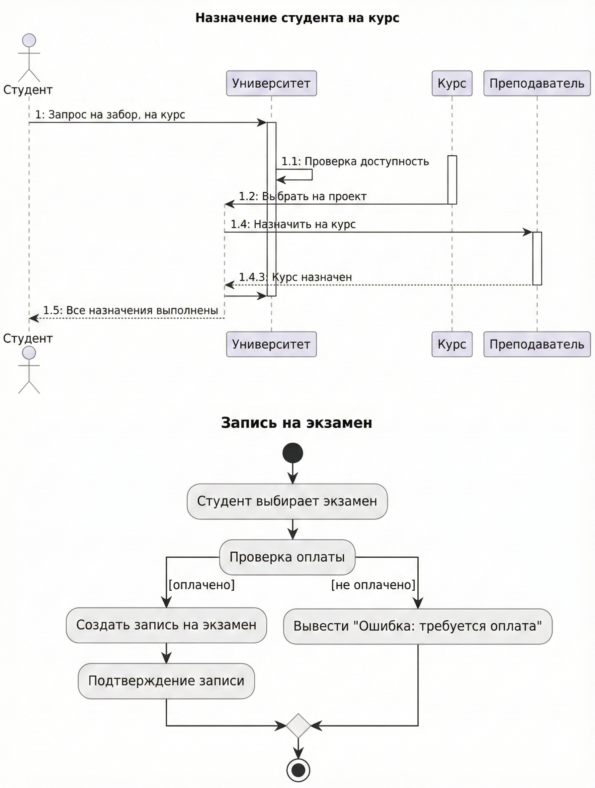
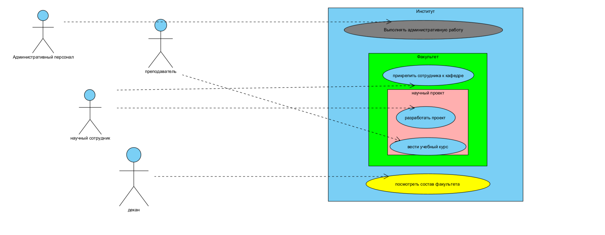

1. Анализ предметной области
   Проведён текстовый анализ задания и выделены ключевые сущности (кандидаты в классы):  
   - `University`, `Faculty`, `Institute`, `Employee`, `ResearchStaff`, `AdministrativeStaff`, `Lecturer`,  
     `Project`, `Course`.

2. Идентификация атрибутов
   Для каждого класса определены атрибуты на основе требований:  
   - Например, у `Employee`: `socialSecurityNumber`, `name`, `email`.  
   - У `Course`: `uniqueNumber`, `name`, `weeklyDuration`.  
   - У `Project`: `name`, `startDate`, `endDate`, `hours`.

3. Определение отношений между классами 
   - Наследование (Generalization):  
     - `ResearchStaff` и `AdministrativeStaff` → наследуются от `Employee`.  
     - `Lecturer` → специализация `ResearchStaff`.  
   - Агрегация/Композиция:  
     - `University` → содержит множество `Faculty`.  
     - `Faculty` → содержит множество `Institute`.  
     - `ResearchStaff` → прикреплён к одной или нескольким `Institute`.  
   - Ассоциации  
     - `ResearchStaff` ↔ `Project` (с атрибутом `hours`).  
     - `Lecturer` ↔ `Course`.

4. Проектирование диаграммы классов (Class Diagram) 
   Создана полная UML-диаграмма классов в Visual Paradigm (или другом инструменте), отражающая структуру системы, атрибуты, методы и отношения.

5. Генерация кода 
   С использованием функции генерации кода (например, Java Round-Trip Engineering) созданы классы на языке Java, соответствующие диаграмме.  
   Добавлены базовые методы ввода/вывода (например, `toString()`, конструкторы, геттеры/сеттеры).

6. **Компиляция и выполнение**  
   Программа успешно скомпилирована и запущена. Продемонстрирована работоспособность:  
   - Создание объектов (например, факультет → кафедра → сотрудник → проект).  
   - Вывод информации о сущностях.

7. **Обратный инженеринг**  
   По сгенерированному Java-коду выполнена обратная генерация диаграммы классов — она полностью соответствует исходной модели.

8. **Поведенческое моделирование**  
   Добавлены следующие диаграммы:  
   - **Диаграмма прецедентов (Use Case Diagram):** отражает взаимодействие пользователей (например, «Администратор», «Преподаватель») с системой.  
   - **Диаграмма последовательностей (Sequence Diagram):** например, сценарий «Назначение научного сотрудника на проект».  
   - **Диаграмма активностей (Activity Diagram)** или **диаграмма состояний (State Machine Diagram):** например, жизненный цикл проекта («Планирование» → «Выполнение» → «Завершение»).

---

### **2. Результаты**
- Полная UML-модель университетской информационной системы.  
- Рабочий объектно-ориентированный код на Java.  
- Подтверждение корректности модели через прямую и обратную генерацию кода.  
- Набор поведенческих диаграмм, раскрывающих динамику системы.

---

### **3. Вывод**
Лабораторная работа выполнена в полном объёме. Были освоены ключевые аспекты UML-моделирования:  

